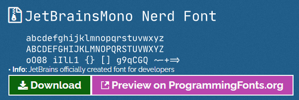

<!-- ## 完成效果 -->


## 0. 准备所需文件

* Windows Terminal

  * 可以在 GitHub 或 Microsoft Store 获取
* [PowerShell] (<https://aka.ms/pscore6>)

  * 一个跨平台的 PowerShell
* [Git Bash] (<https://git-scm.com/downloads>)
  * 可集成在 Windows Terminal Preview 中

## 1. 基础设置调整

### 开启 Terminal  亚克力半透明效果为80%


### 选择 Terminal  配色方案

设置>默认值>外观>配色方案

我选择 One Half Dark


### 集成 Git Bash

#### 名称

```shell
Git Bash
```

#### 命令行: (根据安装目录而定)

```shell
D:\Program Files\git\bin\bash.exe
```

#### 启动目录: (默认)

```shell
%USERPROFILE%
```

#### 图标: (根据安装目录而定)

```shell
D:\Program Files\git\mingw64\share\git\git-for-windows.ico
```

## 2. 安装 nerd 字体

安装 nerd 以显示图标， 不然会显示为方框

[可以在这里挑选并获取喜欢的字体](https://www.nerdfonts.com/font-downloads)

我选择 [JetBrainsMono Nerd Font Mono](https://github.com/ryanoasis/nerd-fonts/releases/download/v2.1.0/JetBrainsMono.zip)



在 Terminal  使用字体 (注意要选择带 nerd 字样的字体)

设置>默认值>外观>字体:


## 3. 主题设置  

参考: [^1]  

### 安装模块

#### 主题美化模块 oh-my-posh

``` shell
Install-Module oh-my-posh -Scope CurrentUser -SkipPublisherCheck
```

#### posh-git 模块

``` shell
Install-Module posh-git -Scope CurrentUser
```

#### 增强模块 PSReadLine

``` shell
Install-Module -Name PSReadLine -AllowPrerelease -Scope CurrentUser -Force -SkipPublisherCheck
```

#### 文件图标库

``` shell
Install-Module -Name Terminal-Icons -Repository PSGallery
```

### 配置 Profile (打开方式二选一)

``` shell
notepad.exe $PROFILE
code $PROFILE
```

在本段中，以下操作均在 $PROFILE 文件中操作

导入主题模块和图标库

``` shell
Import-Module posh-git
Import-Module oh-my-posh
Import-Module -Name Terminal-Icons
```

### 设置主题 ([主题库](https://ohmyposh.dev/docs/themes))

我选择使用 [M365Princess](https://ohmyposh.dev/docs/themes#m365princess)主题

``` shell
Set-PoshPrompt -Theme M365Princess
```

### 自动补全和提示

``` shell
Set-PSReadlineKeyHandler -Key Tab -Function MenuComplete
```

完成后记得保存

### 以下为完整文件及截图

``` shell
Import-Module posh-git
Import-Module oh-my-posh
Set-PoshPrompt -Theme M365Princess
Set-PSReadlineKeyHandler -Key Tab -Function MenuComplete
```


### 重新打开 Terminal  

## 完成啦\(0^◇^0)/

### 参考

[^1]: ["powershell.md"](https://gist.github.com/xiaopeng163/0fe4225a56ff97cd47e25a4b8a6f36ec)
